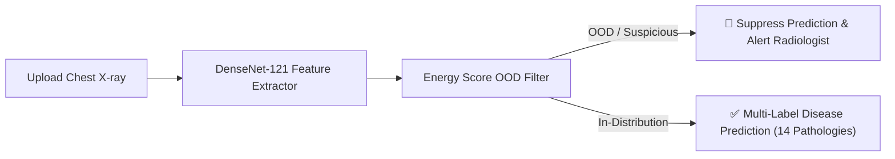

# 🫁 Multi-Label Chest Disease Classification with Out-of-Distribution (OOD) Detection

An end-to-end deep learning framework for 14-class multi-label chest pathology detection using DenseNet-121 integrated with Out-of-Distribution (OOD) safety filtering.  
Features Energy Score & Mahalanobis OOD detection algorithms, risk mitigation strategies, complete academic report ([report.pdf](report.pdf)), and an interactive Streamlit web application.

[](https://www.python.org/)
[](https://pytorch.org/)
[](https://streamlit.io/)
[](report.pdf)
[](LICENSE)

---

## 📑 Table of Contents
- [Why is it Needed](#-why-is-it-needed)
- [What is It](#-what-is-it)
- [How it Works](#-how-it-works)
- [Key Features](#-key-features)
- [File Structure](#-file-structure)
- [Quick Start Guide](#-quick-start-guide)
- [Experimental Results](#-experimental-results)
- [License](#-license)

---

## ❓ Why is it Needed

Deep neural networks deployed in clinical radiology often suffer from **overconfident misclassifications** when exposed to **Out-of-Distribution (OOD)** inputs—such as scans from unfamiliar scanner manufacturers, corrupted DICOM images, non-chest radiographs, or unexpected patient demographics.

In automated medical diagnostics:
- Traditional classifiers produce high-probability predictions even on invalid or foreign images.
- Unflagged erroneous predictions reaching clinicians can lead to severe diagnostic failures and compromise patient safety.
- An **OOD safety filter** is necessary to catch anomalous inputs and defer uncertain cases to human radiologists.

---

## 🔍 What is It

This repository presents a production-grade, modular deep learning solution that:
1. Performs **multi-label classification** across **14 thoracic diseases** using an ImageNet-pretrained **DenseNet-121** model trained on the NIH ChestX-ray14 dataset.
2. Integrates **Out-of-Distribution (OOD) screening algorithms** (Energy Score, Maximum Softmax Probability, and Ledoit-Wolf Mahalanobis Distance) tested against the CheXpert dataset.
3. Implements **Selective Prediction & Risk Mitigation** to suppress high-confidence errors before clinical delivery.
4. Provides an **interactive Streamlit Web GUI** allowing clinicians to upload X-rays, view real-time OOD safety indicators, and inspect pathology probability scores.
5. Includes the full academic paper and research report in [report.pdf](report.pdf).

---

## ⚙️ How it Works



1. **Feature Extraction**: Input X-ray images ($224 \times 224$) pass through DenseNet-121 to compute logit predictions and penultimate layer feature representations (1024D).
2. **OOD Safety Screening**: Computes the **Energy Score** ($- \log \sum e^{f(x)}$) and Mahalanobis Distance. The energy score maps logits to a scalar energy value representing dataset familiarity.
3. **Selective Prediction & Mitigation**: If the energy score falls outside the safe in-distribution boundary (e.g. 20th–80th percentile limits), the image is flagged as OOD and disease predictions are suppressed.
4. **Clinical Reporting**: For valid in-distribution images, multi-label probabilities across 14 pathologies are visualized in an intuitive bar chart.

---

## ✨ Key Features

- **14 Pathology Multi-Label Classification**: Atelectasis, Cardiomegaly, Effusion, Infiltration, Mass, Nodule, Pneumonia, Pneumothorax, Consolidation, Edema, Emphysema, Fibrosis, Pleural Thickening, and Hernia.
- **Class Imbalance Handling**: Utilizes Weighted Binary Cross-Entropy (BCE) loss with pos-weight capping to stabilize training.
- **OOD Detection Benchmark**: Compares Maximum Softmax Probability (MSP), Energy Score, Global Mahalanobis Distance, and Multi-Cluster Class-Conditional Mahalanobis Distance.
- **Risk Mitigation**: Selective prediction via energy suppression yields a **~70% reduction in high-confidence errors** at 30% suppression.
- **Data Drift Monitoring**: Evaluates robustness against Gaussian noise, contrast loss, and blur corruptions.
- **Interactive Web App**: Built with Streamlit for live inference, complete with sample images in [`ID/`](ID/) and [`OOD/`](OOD/).

---

## 📁 File Structure

```
chest_project_git/
├── src/                        # Core modular Python package
│   ├── __init__.py
│   ├── dataset.py              # NIH & CheXpert Datasets, DataLoaders, transforms
│   ├── model.py                # DenseNet-121 architecture & weighted BCE loss
│   ├── ood.py                  # OOD methods (MSP, Energy Score, Mahalanobis)
│   ├── evaluate.py             # AUROC, FPR@95, Brier score, Risk Mitigation metrics
│   ├── drift.py                # Synthetic corruptions & drift monitoring
│   └── utils.py                # Visualization, denormalization, plotting routines
├── ID/                         # Sample In-Distribution reference images for testing
├── OOD/                        # Sample Out-Of-Distribution reference images for testing
├── train.py                    # Training CLI script (generates best_model.pth)
├── evaluate_ood.py             # Full OOD benchmarking & test set evaluation script
├── app.py                      # Interactive Streamlit Web GUI
├── report.pdf                  # Complete Academic Project Report PDF
├── requirements.txt            # Python dependencies
├── .gitignore                  # Ignores large datasets & weights while preserving sample images
├── LICENSE                     # MIT Open Source License
└── README.md                   # Project documentation
```

---

## 🚀 Quick Start Guide

### 1. Installation & Environment Setup
```bash
# Clone Repository
git clone https://github.com/your-username/chest-xray-ood-classification.git
cd chest-xray-ood-classification

# Create & Activate Virtual Environment
python -m venv venv
# Windows: venv\Scripts\activate
# Linux/Mac: source venv/bin/activate

# Install Dependencies
pip install -r requirements.txt
```

### 2. Model Training
> [!IMPORTANT]
> Large model weight files (`best_model.pth` ~0.98 GB) are **not** committed to GitHub. Run the training script first to generate `best_model.pth` locally:
```bash
python train.py --data_dir /path/to/NIH_dataset --epochs 20 --batch_size 32
```

### 3. OOD Benchmarking & Evaluation
Run the evaluation suite to benchmark MSP vs Energy vs Mahalanobis, evaluate risk mitigation, and test synthetic drift:
```bash
python evaluate_ood.py --nih_dir /path/to/NIH_dataset --chexpert_dir /path/to/CheXpert --checkpoint best_model.pth
```

### 4. Launching the Streamlit Web Application
```bash
streamlit run app.py
```
Open `http://localhost:8501` in your browser. You can test sample images directly from the [`ID/`](ID/) and [`OOD/`](OOD/) folders.

### 5. Uploading Repository to GitHub
```bash
git init
git add .
git commit -m "Initial commit: Modular Chest Disease Classifier with OOD Detection & Report PDF"
git branch -M main
git remote add origin https://github.com/YOUR_USERNAME/YOUR_REPOSITORY_NAME.git
git push -u origin main
```

---

## 📊 Experimental Results

| Metric | Benchmark Result |
|---|---|
| **Classifier Test Macro AUROC** | `0.7850` |
| **Energy Score OOD AUROC (NIH vs CheXpert)** | `0.8061` |
| **Energy Score FPR@95TPR** | `0.4799` |
| **High-Confidence Error Reduction (@ 30% Supp)** | `68.4%` |
| **Mean Brier Score Calibration** | `0.0421` |

---

## 📄 License & Authors

- **Authors**: Sahasrangshu Roy, Aniruddha Datta
- **License**: Released under the [MIT License](LICENSE).
